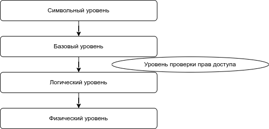
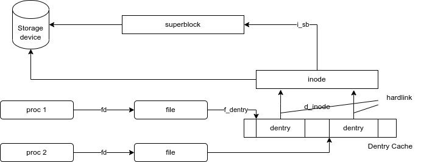

# Лекция 10.03.2023. Файловая подсистема

Файл -- важнейшее понятие. 

Оксфордский словарь по вычислительной технике (нет определение ФС, а есть file managment).

Файл -- "информация, хранимая во вторичной памяти или во вспомогательном ЗУ с целью её сохранения после завершения отдельного задания или преодоления ограничений, связанных с объемом основного ЗУ. В файле могут содержаться данные, программы, тексты и любая другая информация" (с) Оксфордский словарь по ВЧ.

---

Задача файловой системы -- обеспечивать сохранение данных и доступ к сохраненным данным.

**Определение ФАЙЛА**

Файл -- поименованная совокупность данных, хранимая во вторичной памяти, возможно даже бессмысленная. Главное -- к нему можно получить доступ и доступ к файлу в файловых подсистемах получается по его имени. Для того, чтобы обеспечить хранение файла и последующий доступ к этому файлу ФС прежде всего должна обеспечить "изолированность" файлов (isolated and identified).

Файл должен быть изолирован (должен занимать некоторое адресное пространство и оно должно быть защищено). Кроме того, к файлу необходимо обеспечить доступ, доступ к файлу обеспечивается по тому как файл в системе идентифицируется.

***Файловая Система*** -- порядок, определяющий способ организации хранения, именования и доступа к данным на вторичных носителях информации.

Вторичная память -- актуально на время середины 20 века. Далее -- дисковая память (долговременное хранение -- важное слово. Вторичная память должна быть энергонезависимой.)

Есть и временные файлы, рабочие файлы, но основная задача ФС и средств, обеспечивающих хранение данных -- именно долговременное хранение.

Для компов все ЗУ являются ***блочными***.

File Managment -- "программные процессы, связанные с общим управлением файлами, т.е. с размещением во вспомогательной памяти, контролю доступа к файлам, записью резервных копий, ведению справочников (directory). Основные функции управления файлами: ОС, а дополнительные: Система управления файлами" (c) Оксфордский словарь ВЧ.

ФС должна не только обеспечивать хранение, но и доступ к файлам.

Парадигма UNIX "Всё -- файл". ***При этом, если что-то не файл, то это процесс***. Это утверждение справедливо, так как в системе имеются специальные файлы, про которые говорят, что они больше, чем файлы: программные каналы, сокеты, внешние устройства.

С точки зрения именно файловой подсистемы. Файловая подсистема как раз работает с файлами, которые называются "регулярными" и с директориями. При этом Линукс, как и Юникс не делает различия между файлом и директорией (или каталогом), так как каталог -- файл, который содержит имена других файлов.

Стивен Раго: 7 типов файлов (глава файловые каталоги)

- "--" обычный файл
- d directory
- l softlink
- c special character file
- b block device
- s socket
- p named pipe

Существует стандарт, который называется FHS "Filesystem Hierarchy Standard". Этот стандарт определяет структуру и содержимое каталогов.

Ubuntu поддерживает этот стандарт. По этому стандарту корневая файловая система "/" и его ветви обязательно должны составлять единую файловую систему. Расположенную на одном носителе или диске или дисковом разделе. В нем должны располагаться все компоненты, необходимые для старта системы.

Также можно встретить следующее определение **ФАЙЛА**:

Каждая индивидуальная идентифицируемая единица информации называется файлом.

## Задачи Файловой Системы

---

1. Именование файлов
2. Обеспечение программного интерфейса для работы с файлами пользователей или с приложениями (запуск программ на выполнение). Ни системе, ни файловой подсистеме неизвестно, какой файл она хранит и что будет с ним выполняться (не интерпретирует, но обеспечивает возможность работы)
3. Отображение логической модели (логического представления файлов) на физическую организацию хранения данных на соотв. носителях
4. Обеспечивает надежное хранение файлов, доступ к ним и защиту от несанкционированного доступа
5. Обеспечение совместного использования файлов (не задача в полной мере ФС, но задача ОС)

Исходя из этих задач декларируется: для систем UNIX/LINUX следующая иерархическая структура ФС.



Символьный уровень (уровень интерфейса пользователя) -- уровень именования файлов (наиболее удобный для человека). ПОдчеркивается, что файл назван файлов из человеческой практики.

!! Стандарт поддерживает иерархическую организацию каталогов !!

Базовый уровень. Имя файла не является идентификатором. Имя файла необходимо лишь для того, чтобы пользователь мог работать с файлом в наиболее удобном формате. Файл может иметь разные имена (хардлинки). Но в системе безусловно файл должен быть идентифицирован. В линукс файл идентифицируется inode'ом (index node -- индексный узел), устоявшееся название. Безусловно в системе существует `struct inode`, поскольку номер inode'a это и есть фактически идентификатор файла, а структура нужна чтобы предоставить системе необх. объем информации для работы с файлом, так же как процесс имеет идентификатор и дескриптор `struct task_struct`

В UNIX всё файл -- сама система должна обеспечивать эту парадигму. С точки зрения обычных файлов и каталогов, которые также рассматриваются как файлы. Проверка полномочий -- сложная комплексная задача, которая по-разному решается для разных типов файлов в системе.

Логический уровень. Текстовые файлы, бинарные файлы... Когда создаем файл -- указатель файла стоит на нуле. Каждая операция чтения/записи перемещает указатель файла на определенное количество байт. Си в этом случае, как язык очень последовательный, функция в Си работает с определенным количеством байтов. Для языка Си файл -- всегда последовательность байтов (даже в бинарных файлах). В паскале облегчают жизнь программистам -- там речь идет о блоках. Character-oriented (байт-ориентированные)/Block-oriented (блок-ориентированные) files. Два типа файлов: символьные (байт-ориентированные, т.к. символ определяется одним байтом) и блочные

Физический уровень. Уровень физического хранения данных, он определяется особенностями средств аппаратных (дисками/магнитными лентами). Всегда подчеркивалась связь задачи долговременного хранения данных и быстродействия устройств, предназначенного для долговременного хранения. Это связано с понятием уровня иерархии (близость к процессору).

Особенность дисков как блочных устройств.

---

---

Несвязанное распределение. Файлу выделяются участки на диске вразброс. Система должна обеспечить возможность адресации каждого такого участка.

## Linux Filesystem

Между ФС Линукс и Юникс есть разница. Разница эта связана с предоставляемым интерфейсом. UNIX и Linux позволяют работать с очень большим количеством самых разных файловых систем. Для этого UNIX предоставляет интерфейс, который называется VFS/vnode. VFS -- virtual filesystem. vnode - virtual node. В Linux - VFS. Линукс отказался от vnode.


ext.

ext2, ext4, XFS, VFS, NTFS, MS-DOS, FAT, FAT32, MPFS, NFS, ...

Эту возможность обеспечивает виртуальная ФС.

VFS -- интерфейс, с помощью которого система может работать с большим количеством файловых систем. Основой такой работы (базовым действием) является монтирование. Т.е. прежде чем какая-то файловая система станет доступна, это значит, что мы сможем увидеть каталоги и файлы данной файловой системы, она должна быть смонтирована. Для этого существует команда mount.

Структура слоёв VFS.


Все операции с файлами на подмонтированных файловых системах осуществляются через интерфейс VFS. Этот интерфейс, или, как говорят, внутренняя организация VFS, базируется на четырех структурах. Т. е. в основе интерфейса VFS лежат четыре структуры. Это:

```
   struct

1. Superblock
2. Dentry
3. inode
4. file
```

Связь структур



Superblock описывает подмонтированную ФС на диске. Обеспечивает возможность работать с файловой системой.

Dentry -- directory entry. Структура, которая описывает экземпляр директории. Не хранится нигде, создается налету.

inode -- struct inode -- дескриптор файла. Существует два типа inode'ов. Дисковый inode описывает физические файлы. В ядре есть ядреный inode, который позволяет в ядре предварительно контроллировать доступ к файлу.

файл -- тихо лежит на диске, либо открытый файл ( с которым работает процесс ). Открытые файлы описываются структурой struct file. Системная таблица открытых файлов. Каждый процесс имеет собственную таблицу открытых файлов, дескриптор которой ссылкается на дескриптор открытых файлов в системе. Кроме того, каждый процесс, до того как он был запущен на выполнение, был файлом, тихо лежал на диске и никому не мешал, значит он принадлежал какой-то ФС, поэтому в tast_struct имеется два указателя: на ФС, которой принадлежит файл программы и указатель на таблицу открытых файлов процесса.

Доступ к файлу производится ***через ПРОЦЕСС***.

Вся файловая подсистема должна занимать или диск или раздел диска, начинаться с корневого каталога -> любая ФС монтируется к этому общему дереву каталогов. Монтируется в поддиректорию. Эта подмонтированная файловая система описывается суперблоком (`struct superblock`), она должна занимать некоторый раздел жесткого диска.

## Раздел жесткого диска с файловой системой ext2

Некоторые поля структуры `struct superblock`.
